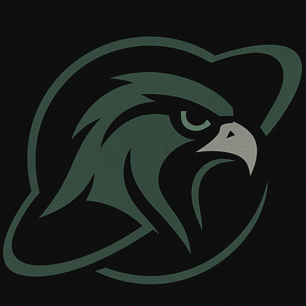
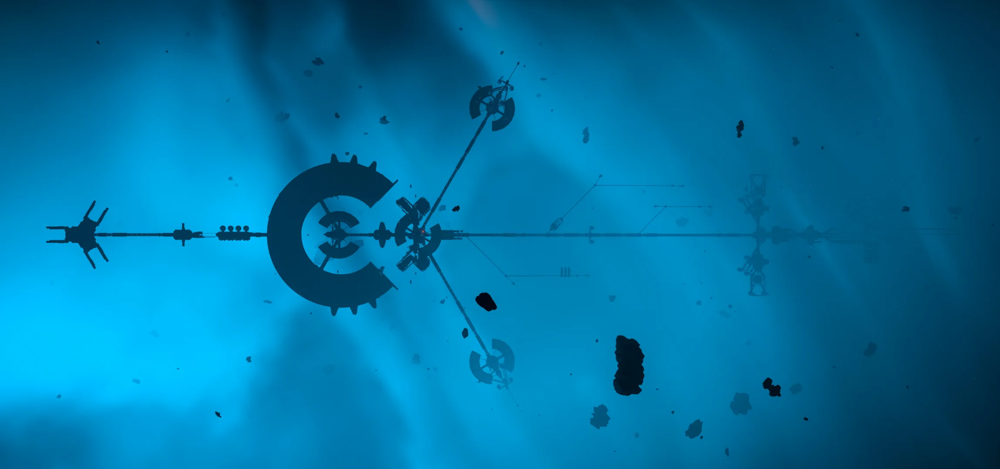
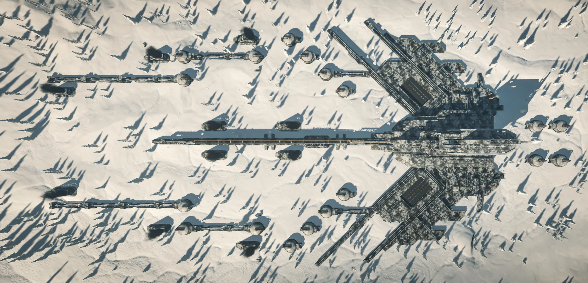
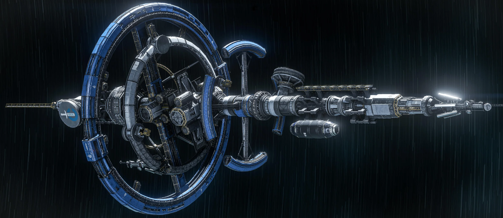
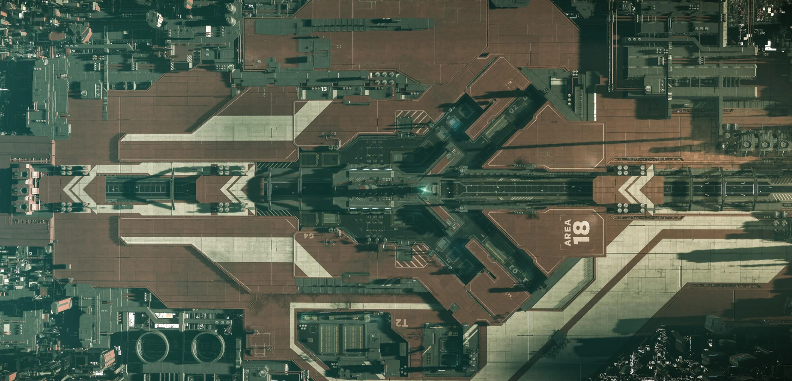

<div align="center">
  
  
  # Khalai Makhlooq (KHLA) Command Center
  
  <p>
    <strong>Official Web Infrastructure, Roster, & Fleet Management System</strong>
  </p>

  <p>
    <a href="https://nextjs.org"></a>
    <a href="https://react.dev"></a>
    <a href="https://supabase.com"></a>
    <a href="https://tailwindcss.com"></a>
    <a href="https://threejs.org"></a>
    <a href="https://nodejs.org/"></a>
  </p>
</div>

<br />

<div align="center">
  
</div>

<br />

> A highly immersive, interactive, and automated web presence for the **Khalai Makhlooq** Star Citizen organization. Built with modern web technologies, featuring real-time roster syncing, a dynamic 3D fleet viewer, and a securely integrated administrative control panel.

---

## 📑 Table of Contents
- [✨ Key Features](#-key-features)
- [🛠️ Tech Stack](#️-tech-stack)
- [🗄️ Database Architecture](#️-database-architecture)
- [📸 Gallery](#-gallery)
- [⚙️ Local Development Setup](#️-local-development-setup)
- [📂 Project Structure](#-project-structure)
- [🤝 Contributing](#-contributing)

---

## ✨ Key Features

- **🌐 Automated Roster Synchronization**  
  Includes a dedicated Discord bot running silently in the background, communicating with `starcitizen-api.com`. It automatically fetches live organizational data (handles, ranks, avatars) and syncs it to our database every 12 hours.

- **🛸 3D Fleet Viewer & Command System**  
  Explore the organization's fleet in an interactive 3D viewport powered by Three.js. Supports loading high-fidelity `.glb` ship models or generating intelligent holographic fallbacks based on the ship's classification. Directly integrated with the **FleetYards API**.

- **📊 Interactive Team Network Graph**  
  An immersive, physics-based, Obsidian-style network graph that visualizes the organization's roster, connecting members back to the central KHLA hub.

- **🛡️ Secure Admin Panel & CMS**  
  A secure management dashboard protected by Supabase Auth and Discord OAuth. Authorized admins can dynamically register new fleet slugs, toggle visibility, post news updates with media attachments, and validate configurations in real-time.

- **🎨 Premium UI/UX Aesthetics**  
  Built with a "vibe-engineered" approach utilizing glassmorphism, deep contrast cyberpunk themes, modern HUD interfaces, interactive cursors, and buttery-smooth page transitions via `motion/react`.

---

## 🛠️ Tech Stack

| Category | Technologies |
|---|---|
| **Frontend Framework** | Next.js 14 (App Router), React 18, TypeScript/JavaScript |
| **Styling & Animation** | Tailwind CSS, Lucide React, Framer Motion (`motion/react`) |
| **3D Rendering** | Three.js, `@react-three/fiber`, `@react-three/drei` |
| **Backend & Database** | Supabase (PostgreSQL / Storage), Next.js Serverless API Routes |
| **Authentication** | Discord OAuth2, Supabase Auth |
| **External Integrations** | StarCitizen-API, FleetYards Public API |

---

## 🗄️ Database Architecture

The core relational database schema running on Supabase PostgreSQL.

```mermaid
erDiagram
    TEAM_MEMBERS {
        uuid id PK
        string discord_id "Unique ID from Discord"
        string handle "In-game RSI Handle"
        string rank "Org Rank"
        string avatar_url "Profile Image"
    }
    
    FLEET_SHIPS {
        uuid id PK
        string ship_name "Display Name"
        string slug "FleetYards Slug"
        string manufacturer "Ship Maker"
        string classification "Ship Role/Type"
    }
    
    ABOUT_NEWS {
        uuid id PK
        string title "Headline"
        text body "Main content"
        string media_url "Image/Video URL"
        string media_type "image or video"
        timestamp published_at "Post Date"
    }
    
    ABOUT_SETTINGS {
        uuid id PK
        string bridge_background_url "Custom hero bg"
        string archives_background_url "Custom archives bg"
    }
    
    FLEET_CONFIGS {
        uuid id PK
        string setting_name
        string setting_value
    }
    
    TEAM_MEMBERS ||--o{ FLEET_SHIPS : "owns"
```



---

## 📸 Gallery

<div align="center">
  
  
</div>
<br />
<div align="center">
  
</div>

---

## ⚙️ Local Development Setup

### 1. Prerequisites
- **Node.js** (v18+)
- A **Supabase Project** (Database & Auth)
- A **Discord Developer Application** (for Bot and OAuth)
- A **StarCitizen-API.com Key**

### 2. Environment Variables
Create a `.env.local` file in the root directory and configure your keys:

```env
# Supabase Configuration
NEXT_PUBLIC_SUPABASE_URL=your_supabase_project_url
NEXT_PUBLIC_SUPABASE_ANON_KEY=your_supabase_anon_key
SUPABASE_SERVICE_ROLE_KEY=your_service_role_key

# Discord OAuth & Bot Configuration
DISCORD_CLIENT_ID=your_discord_client_id
DISCORD_CLIENT_SECRET=your_discord_client_secret
DISCORD_BOT_TOKEN=your_discord_bot_token
DISCORD_GUILD_ID=your_discord_server_id
ADMIN_DISCORD_IDS=your_discord_id_here

# External APIs
SC_API_KEY=your_starcitizen_api_key
```

### 3. Database Initialization
Execute the SQL migration files found in the `/supabase/migrations` folder inside your Supabase SQL Editor. Ensure you apply schemas for:
- `about_news` & `about_settings`
- `fleet_ships` & `fleet_configs`
- `team_members`

*Ensure your Supabase storage buckets (e.g. `media`) are created and set to **Public**.*

### 4. Running the Project

**Start the Next.js Web Application:**
```bash
npm install
npm run dev
```
The website will be available at `http://localhost:3000`.

**Start the Discord Sync Bot (In a separate terminal):**
```bash
cd discord-bot-master
npm install
node deploy-commands.js # Register slash commands
npm run start
```

---

## 📂 Project Structure

```text
makhlooq/
├── app/                  # Next.js App Router (Home, Fleet, Team, About, Admin)
│   ├── admin/            # Secure Admin & CMS Dashboards
│   ├── api/              # Serverless API endpoints (Supabase & FleetYards Proxy)
│   └── globals.css       # Global stylesheet & Tailwind directives
├── src/
│   └── components/       # Reusable React components (3D Scene, Modals, UI)
├── public/               # Static assets (Images, Logos, Backgrounds)
├── supabase/             # Database migration SQL files
└── discord-bot-master/   # Standalone Node.js roster sync bot
```

---

## 🤝 Contributing

For organization members looking to contribute code or 3D models:
1. Ensure all `.glb` files are optimized and compressed (Draco compression recommended).
2. Create feature branches off of `main` (e.g., `feature/hud-improvements`).
3. Ensure no hydration mismatches occur when dealing with 3D components or custom cursors.
4. Run `npm run build` locally before opening a Pull Request.

<br />

<div align="center">
  
  <br />
  <i>See You In The 'Verse.</i>
</div>
